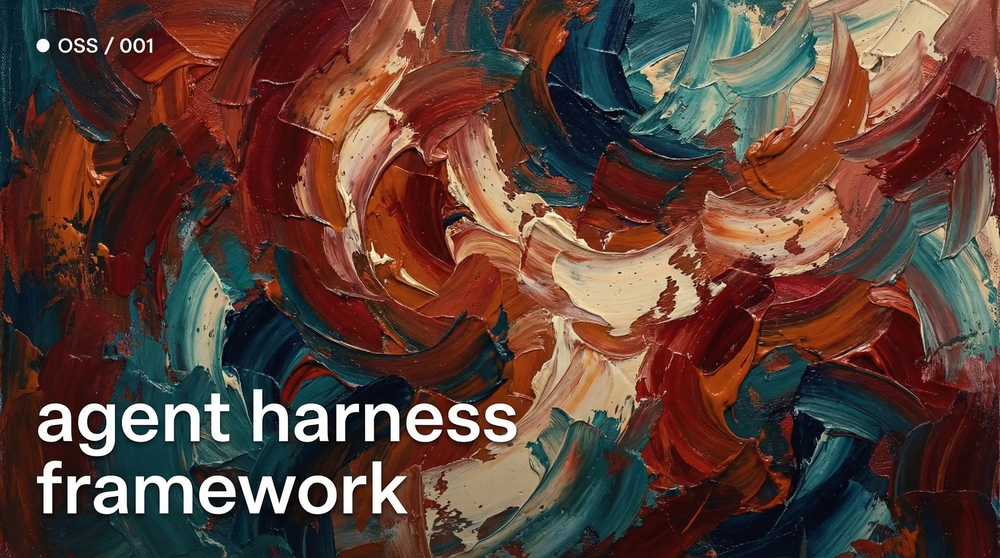

# Agent Harness



[](https://nodejs.org/)
[](https://pnpm.io/)
[](LICENSE)

Unified AI agent configuration management for Codex, Claude, and Copilot.

Agent Harness is a TypeScript CLI tool and library that manages AI agent configurations (prompts, skills, and MCP server configs) from a single source of truth, generating provider-specific outputs for OpenAI Codex, Anthropic Claude Code, and GitHub Copilot.

## Features

- Single source of truth for all agent configurations in the `.harness/` directory
- Multi-provider support with simultaneous output generation for Codex, Claude, and Copilot
- System prompt management with provider-specific overrides
- Reusable skill management synchronized across providers
- Centralized MCP server configuration with merged outputs
- Watch mode for automatic regeneration on file changes
- Strict file ownership with manifest-based integrity enforcement

## Quick Start

```bash
# Install dependencies
pnpm install

# Build the project
pnpm build

# Initialize harness in a project
cd /path/to/your/project
harness init

# Enable providers
harness provider enable codex claude copilot

# Add a system prompt
harness add prompt

# Add a skill
harness add skill my-skill

# Add MCP config
harness add mcp my-mcp

# Generate outputs
harness apply

# Watch for changes
harness watch
```

## Installation

### From npm (not yet published)

```bash
npm install -g agent-harness
```

### From source

```bash
git clone <repo-url>
cd agent-harness
pnpm install
pnpm build
```

The CLI is available at `packages/toolkit/dist/cli.js`.

## CLI Commands

| Command | Description |
|---------|-------------|
| `harness init` | Initialize `.harness/` structure |
| `harness provider enable <id>` | Enable a provider (codex/claude/copilot) |
| `harness provider disable <id>` | Disable a provider |
| `harness add prompt` | Add system prompt entity |
| `harness add skill <id>` | Add a skill entity |
| `harness add mcp <id>` | Add an MCP config entity |
| `harness remove <type> <id>` | Remove an entity |
| `harness validate` | Validate manifest and files |
| `harness plan` | Preview changes (dry-run) |
| `harness apply` | Generate provider outputs |
| `harness watch` | Watch mode with auto-apply |

## Project Structure

```
.harness/
├── manifest.json          # Entity registry
├── manifest.lock.json     # Generated state lock
├── managed-index.json     # Managed file index
└── src/
    ├── prompts/
    │   └── system.md                    # System prompt
    │   ├── system.overrides.codex.yaml
    │   ├── system.overrides.claude.yaml
    │   └── system.overrides.copilot.yaml
    ├── skills/
    │   └── my-skill/
    │       ├── SKILL.md
    │       ├── OVERRIDES.codex.yaml
    │       ├── OVERRIDES.claude.yaml
    │       └── OVERRIDES.copilot.yaml
    └── mcp/
        ├── my-mcp.json
        ├── my-mcp.overrides.codex.yaml
        ├── my-mcp.overrides.claude.yaml
        └── my-mcp.overrides.copilot.yaml
```

## Generated Outputs

| Entity | Codex | Claude | Copilot |
|--------|-------|--------|---------|
| Prompt | `AGENTS.md` | `CLAUDE.md` | `.github/copilot-instructions.md` |
| Skills | `.codex/skills/` | `.claude/skills/` | `.github/skills/` |
| MCP | `.codex/config.toml` | `.mcp.json` | `.vscode/mcp.json` |

## Monorepo Packages

### `@agent-harness/manifest-schema`

Zod schemas and TypeScript types for manifests, locks, and sidecars.

```typescript
import type { AgentsManifest, ProviderId, EntityRef } from '@agent-harness/manifest-schema';
```

### `agent-harness`

The main toolkit with CLI and core engine.

```typescript
import { Planner, ProviderAdapter } from 'agent-harness';
```

## Development

```bash
# Install dependencies
pnpm install

# Build all packages
pnpm build

# Run type checks
pnpm typecheck

# Run tests
pnpm test

# Lint and format
pnpm check:write

# Watch mode during development
pnpm --filter agent-harness watch
```

## Architecture

See [docs/architecture.md](docs/architecture.md) for detailed design documentation.

## Supported Providers

- **OpenAI Codex** - AGENTS.md and .codex/ configuration
- **Anthropic Claude Code** - CLAUDE.md and .claude/ configuration
- **GitHub Copilot** - .github/ copilot-instructions and skills

## License

MIT
